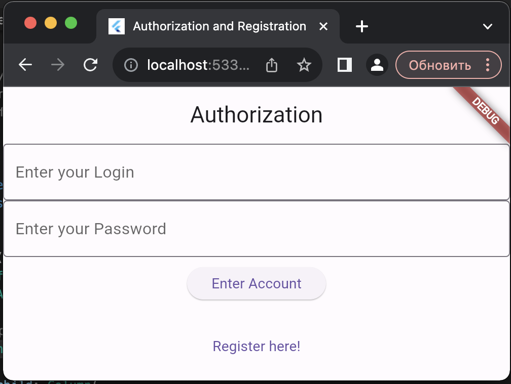
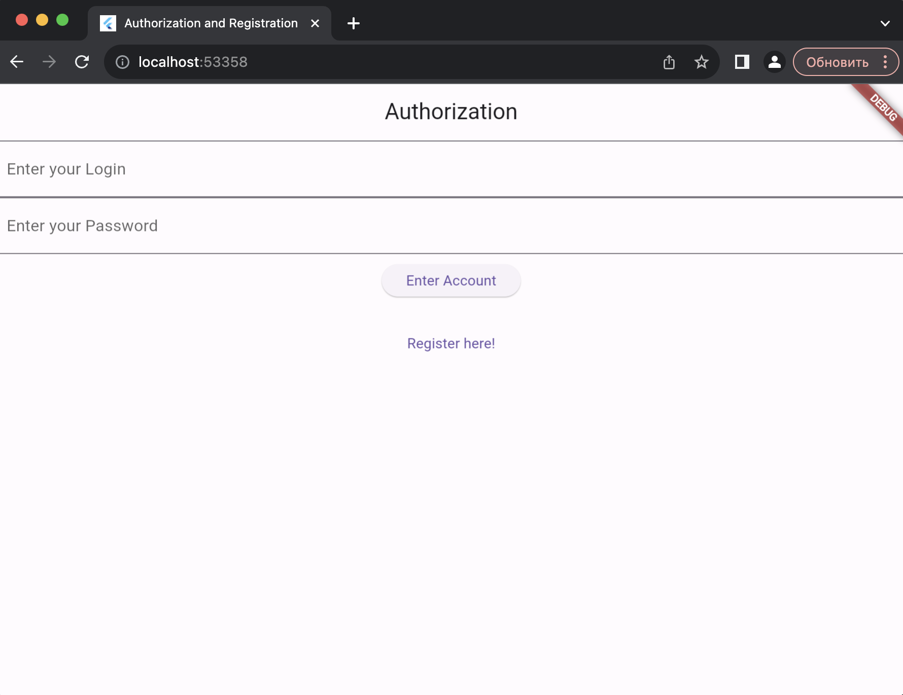
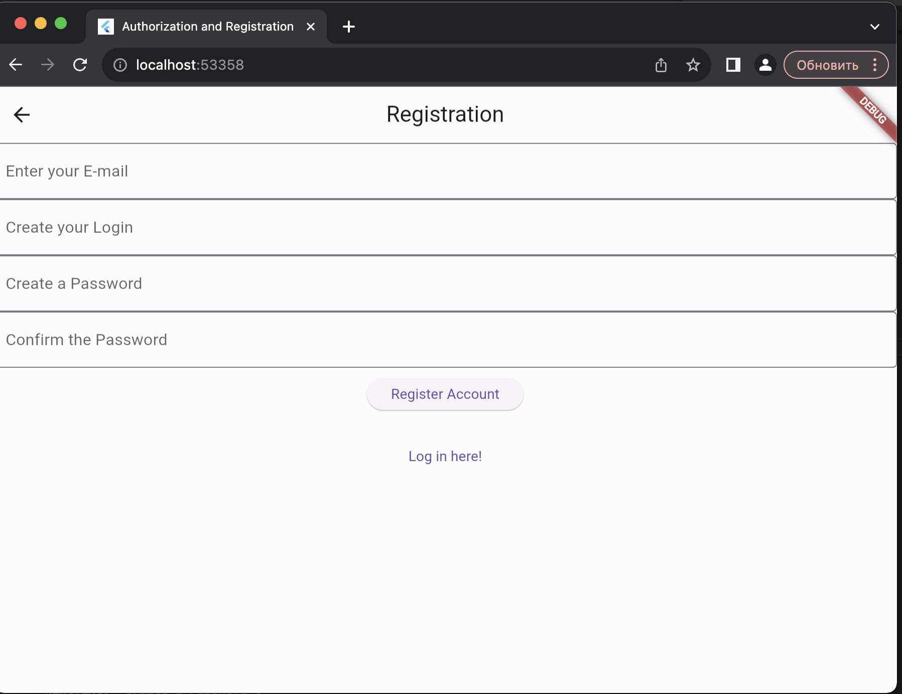
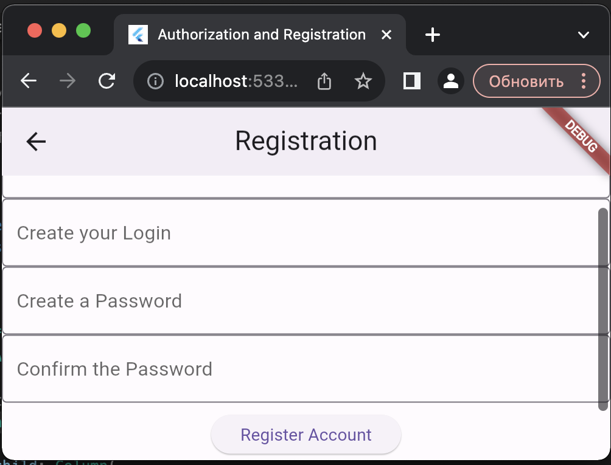

# Two windows and a button.

A Flutter Project with two windows and buttons that move you from one window to another.

## Auth window.
The Home window. Has TextFields for Login and Password, a button to enter account (does nothing) and a button to go to a registration window.

This is how it looks like at the minimum size in browser.

And this is when it's stretched.

## Registration window.
Can be accessed by pressing the registration button on the logging in window. Has a few TextFields for email, login and password, a button to register (does nothing) and a button to go to a logging in window.

This is how it looks like stretched.

And this is at the minimum size. As you can see, there's a scroll to scroll down to the buttons.

